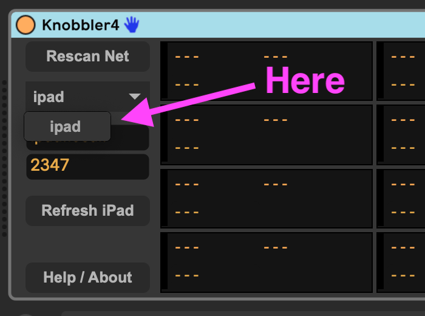

# Knobbler4

Knobbler4 turns your iPad into an auto-labeling, auto-coloring, multitouch parameter control surface for Ableton Live.

Map parameters to sliders on the iPad with a single touch. No need to enter and exit a mapping mode. 

Parameter mapping configuration is saved with your Live Set, so you can switch between songs with minimal friction. Track, device, and parameter names are kept synchronized with your Live Set as you change them, even track colors!

Parameter sliders and values are updated in real time, with the same units (e.g. dB, ms, %) displayed as what you see in Live.

Also provides a high-resolution slider that operates on the currently selected parameter in your Live Set, and a Record-Enable toggle switch to improve the process of overdubbing automation.

## Installation

### Requirements

- Computer running Ableton Live 12
- iPad running [TouchOSC](https://hexler.net/touchosc#get)

### Steps

1. Download the .zip file from the latest [release](https://github.com/zsteinkamp/m4l-Knobbler4/releases)
1. Unzip the file
1. Drag the `Knobbler4.amxd` file to Live's User Library
1. Add Knobbler4 to a MIDI/Instrument track in your Live Set
1. Copy the `Knobbler4.tosc` file to your iPad (e.g. with AirDrop)
1. Configure TouchOSC on the iPad to talk OSC to your computer
   - Click the Chain icon in the toolbar
   - Select "OSC" in the left-side menu
   - Click "Browse" under Connection 1
   - You should see your computer's hostname followed by "Knobbler4"
   - Select that item, then select the IPv4 address in the sub-menu (e.g. 10.1.1.1:2346)
     
   - Set the "Receive Port" to 2347. This is the port that TouchOSC on the iPad listens on.
     
   - Press `Done` in the upper-right
1. In the TouchOSC toolbar, press the "Play" (triangle) icon to toggle out of Editor mode.
1. Back in Knobbler, click "Rescan Net".
1. Your iPad should show up in the drop-down below. Select it, and you should be in business!
   

## Usage

### Mapping Parameters

1. Select any parameter in Ableton Live by clicking on it. A border or corners of a border will appear around the object.
2. Touch any unmapped slider on the iPad screen.
3. Voila!

### Unmapping Parameters

1. Touch the `X` icon in the upper-left corner of the iPad screen. The sliders will all turn into red rectangles.
2. Touch a red rectangle to unmap the parameter.
3. Touch the `X` icon again to leave unmapping mode.

### Current Param Slider

Along the bottom of the iPad screen is a horizontal slider that is used to control the currently selected parameter in your Live Set. This parameter does not have to be mapped to a slider. You can use that slider to control the paramter with a high degree of accuracy.

### Toggle Record Enable

Recording automation is sometimes frustrating, especially in MIDI tracks since you cannot disable recording easily. I created this feature so that I could easily record and overdub automation without recording into or changing anything about MIDI clips.

The Toggle Record Enable button gives you a way to easily disable and re-enable MIDI or audio recording in the currently selected track. The input settings are retained when recording is disabled.

## Development

See the docs at [the m4l-typescript-base repo](https://github.com/zsteinkamp/m4l-typescript-base) for instructions on how to develop in this device.

## TODOs

- ...

## Feedback Welcome!

Please let me know if you have any stories, good or bad, about your Knobbler4 experience. I'd love to hear your feedback and ideas of how to make it better! zack@steinkamp.us