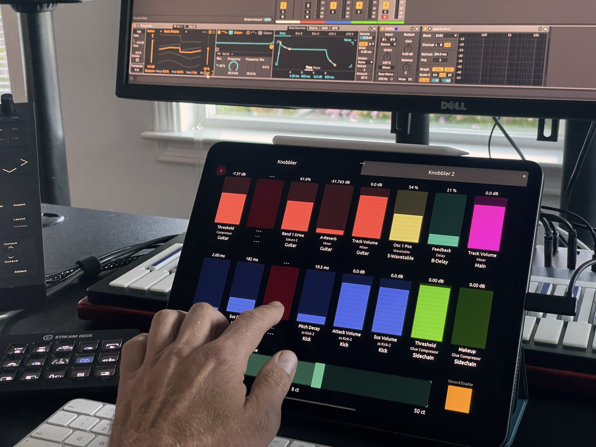
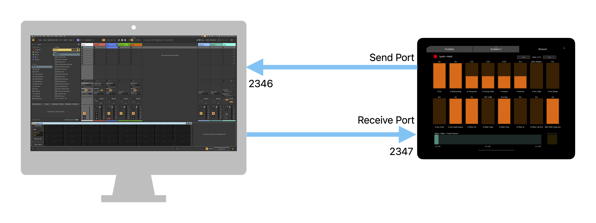
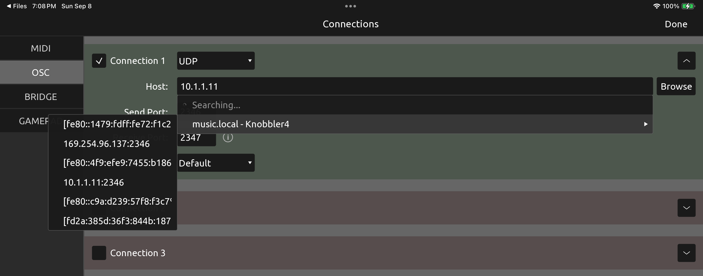
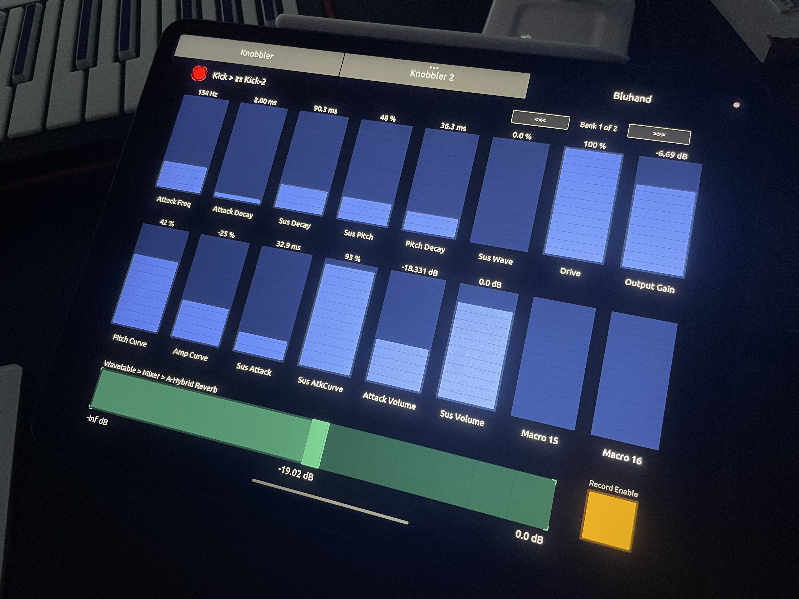

# Knobbler4

Knobbler4 turns your iPad or Android tablet into an auto-labeling, auto-coloring, multitouch parameter control surface for Ableton Live. Add the Knobbler4 device to your Live Set and use your tablet to control devices and parameters.

Map parameters in your Ableton Live set to unmapped sliders on the tablet with a single touch. No need to enter and exit a mapping mode. Access every parameter in the currently selected device, directly on the tablet.

Parameter mapping configuration is saved with your Live Set, so you can switch between songs with minimal friction. Track, device, and parameter names are kept synchronized with your Live Set as you change them, even track colors!

Parameter sliders and values are updated in real time, with the same units (e.g. dB, ms, %) displayed as what you see in Live. Double tap a slider on the tablet to reset the parameter to its default value.

Also provides a high-resolution slider that operates on the currently selected parameter in your Live Set, and a Record-Enable toggle switch to improve the process of overdubbing automation.

[Here is a playlist of videos featuring Knobbler4](https://www.youtube.com/playlist?list=PLqzTnRgmRId6cHDkhw_qqJL7dC67Qu440).

## Installation

### Requirements

- Computer running Ableton Live 12
  - Ensure "Local Network" permissions are granted to Ableton Live. See [Troubleshooting](TROUBLESHOOTING.md) for more details.
- iPad or Android tablet running [TouchOSC](https://hexler.net/touchosc#get)
  - Ensure "Local Network" permissions are granted to TouchOSC. See [Troubleshooting](TROUBLESHOOTING.md) for more details.

### Steps

_(If, after following the steps below, you are having troubles, then see the [Troubleshooting](TROUBLESHOOTING.md) page.)_

1. Download the .zip file from the latest [release](https://github.com/zsteinkamp/m4l-Knobbler4/releases)
1. Unzip the file
1. Drag the `Knobbler4.amxd` file to Live's User Library
1. Add Knobbler4 to a MIDI/Instrument track in your Live Set
1. Copy the `Knobbler4.tosc` (or `Knobbler4-with-bluhand.tosc`) file to your tablet (e.g. with AirDrop)
1. Configure TouchOSC on the tablet to talk OSC to your computer. (NOTE: If you want to connect over USB, see the [instructions here](USB.md).)
   
   - In TouchOSC on the tablet, click the Chain icon in the toolbar
   - Select "OSC" in the left-side menu
   - Click "Browse" under Connection 1
   - You should see your computer's hostname followed by "Knobbler4"
     - If your computer's hostname does not appear, see [Troubleshooting](TROUBLESHOOTING.md).
   - Select that item, then select the IPv4 address in the sub-menu (e.g. 10.1.1.1:2346)
     
   - Set the "Receive Port" to 2347. This is the port that TouchOSC on the tablet listens on.
     
   - Press `Done` in the upper-right
1. In the TouchOSC toolbar, press the "Play" (triangle) icon to toggle out of Editor mode.
1. Back in Knobbler, click "Rescan Net".
1. Your tablet should show up in the drop-down below. Select it, and you should be in business!
   
   - If the tablet does not show up, see [Troubleshooting](TROUBLESHOOTING.md).

_NOTE: You **MUST** have a control surface configured in Ableton Live. If you do, then you will see the "Blue Hand" icon in the title bar of the selected device._

If you don't see it, see instructions in the [Troubleshooting](TROUBLESHOOTING.md) document to fix that.

## Usage

### Mapping Parameters

1. Select any parameter in Ableton Live by clicking on it. A border or corners of a border will appear around the object, e.g. "Frequency" below...

   

2. Touch any unmapped slider on the tablet screen.
3. Voila!

### Unmapping Parameters

1. Touch the `X` icon in the upper-left corner of the tablet screen. The sliders will all turn into red rectangles.
2. Touch a red rectangle to unmap the parameter.
3. Touch the `X` icon again to leave unmapping mode.

### Bluhand

Ableton Live uses a blue hand icon to indicate which device is currently under control of a control surface.

   

If you use the `Knobbler4-with-Bluhand.tosc` TouchOSC layout on your tablet, then you can use the `Bluhand` tab to access all of the parameters the currently selected device offers.

   

If the current device has more than 16 parameters, then you can use the `<<<` and `>>>` controls in the upper-right of the Bluhand tab to access different banks / pages of parameters.

HOT TIP: You can assign a keystroke to a device. This lets you access all of a device's parameters on the tablet with a single keystroke. To do this:

- Press Cmd-K
- Select the device you want to assign
- Press the key you want to use to focus that device
  
- Press Cmd-K to exit mapping mode
  Now, with TouchOSC on the Bluhand tab, you can press a single key (e.g. "k" for your kickdrum) and access all of its parameters on the tablet.
  

NOTE: If you do not see the Blue Hand icon on the current device, then go to the Ableton Live settings and configure any control surface to connect any input port. You may need to configure an IAC MIDI port in the Audio MIDI Setup app if on a Mac.

### Double-tap Default

Double-tap any slider to return the parameter to its default value.

### Jump to Track

Tap a track name on one of the Knobbler tabs to navigate to that track in Live.

### Current Param Slider

Along the bottom of the tablet screen is a horizontal slider that is used to control the currently selected parameter in your Live Set. This parameter does not have to be mapped to a slider. You can use that slider to control the paramter with a high degree of accuracy.

### Toggle Record Enable

Recording automation is sometimes frustrating, especially in MIDI tracks since you cannot disable recording easily. I created this feature so that I could easily record and overdub automation without recording into or changing anything about MIDI clips.

The Toggle Record Enable button gives you a way to easily disable and re-enable MIDI or audio recording in the currently selected track. The input settings are retained when recording is disabled.

## Changelog

- 2025-02-19 [v25](https://github.com/zsteinkamp/m4l-Knobbler4/releases/download/v25/Knobbler4-v25.zip) - Fix bug related to adding/removing VST parameters - ended up nicely simplifying parameter logic in Bluhand
- 2025-02-18 [v24](https://github.com/zsteinkamp/m4l-Knobbler4/releases/download/v24/Knobbler4-v24.zip) - Watch `has_audio_output` more closely to enable/disable mixer controls appropriately. Thanks Andrew Norris for the bug report! Check out Andrew's stuff at https://andrewnorris.uk/
- 2025-02-16 [v23](https://github.com/zsteinkamp/m4l-Knobbler4/releases/download/v23/Knobbler4-v23.zip) - Detect control surfaces and show a warning if not present (required for Bluhand); Overhaul refresh system to be snappier and not get lost; Fix bug in exclusive arm code that would try to arm un-armable tracks and generate a warning in the Max console.
- 2025-02-14 [v22](https://github.com/zsteinkamp/m4l-Knobbler4/releases/download/v22/Knobbler4-v22.zip) - Support exclusive arm/solo
- 2025-02-13 ~~[v21](https://github.com/zsteinkamp/m4l-Knobbler4/releases/download/v21/Knobbler4-v21.zip) - Support channel mixer view in the native app; Direct mapping from Bluhand to Knobbler; Move more nav logic from the ipad app into the device for better performance and reliability; Imported Ableton's device parameter bank definitions from control scripts.~~
- 2025-02-05 [v20](https://github.com/zsteinkamp/m4l-Knobbler4/releases/download/v20/Knobbler4-v20.zip) - Handle collapsed tracks, stability improvements; ability to just refresh menu data.
- 2025-02-03 [v19](https://github.com/zsteinkamp/m4l-Knobbler4/releases/download/v19/Knobbler4-v19.zip) - Support device on/off; Pass device and rack types to native app; Cache device name lookups for Bluhand banks; Cache parent colors.
- 2025-02-01 [v18](https://github.com/zsteinkamp/m4l-Knobbler4/releases/download/v18/Knobbler4-v18.zip) - Adds automation state and enabled/disabled (green circle / greyed out) where appropriate; Make rack macro knobs share the layout they have on screen (two rows evenly divided).
- 2025-01-29 [v17](https://github.com/zsteinkamp/m4l-Knobbler4/releases/download/v17/Knobbler4-v17.zip) - Adds session record button state; Adds the Main channel to the Bluhand channel list.
- 2025-01-26 [v16](https://github.com/zsteinkamp/m4l-Knobbler4/releases/download/v16/Knobbler4-v16.zip) - More functionality for the native iPad app around browsing tracks and devices in your set, metronome toggle, tap tempo button, tempo text input. Limits macro sliders in Bluhand to the number of visible macros.
- 2025-01-22 [v15](https://github.com/zsteinkamp/m4l-Knobbler4/releases/download/v15/Knobbler4-v15.zip) - Adds functionality around play, stop, record, MIDI Overdub, Re-Enable Automation, Capture MIDI, Toggle Input Enable, Marker prev/next navigation, and Loop. This is all in support of the native iPad app.
- 2025-01-21 [v14](https://github.com/zsteinkamp/m4l-Knobbler4/releases/download/v14/Knobbler4-v14.zip) - Fixes a critical bug in v13 that prevented Knobbler knob mapping from working.
- 2025-01-20 v13 - Support features in the native iPad app: Bank buttons, track/device navigation buttons (DOWNLOAD DISABLED - BUGFIX IN v14 ABOVE)
- 2025-01-12 [v12](https://github.com/zsteinkamp/m4l-Knobbler4/releases/download/v12/Knobbler4-v12.zip) - New more compact tabbed UI; Bluhand device presets now in the UI; Fix bug with shortcut buttons that could make re-opening a set assign the buttons incorrectly; Curated parameter banks for some stock Live devices (not done); Use live.banks for Max for Live devices on Bluhand; Fix small bug in bluhand that was emitting errors into the console.
- 2025-01-04 [v11](https://github.com/zsteinkamp/m4l-Knobbler4/releases/download/v11/Knobbler4-v11.zip) - Fix bugs in Bluhand: 1) values would not sync unless the slider was touched 2) double-tap did not return to default; Implement `/syn` handler, responds with `/ack` to enable improved setup UI in the native app.
- 2024-12-20 [v10](https://github.com/zsteinkamp/m4l-Knobbler4/releases/download/v10/Knobbler4-v10.zip) - Fix a bug in Current Param Knob that displayed garbled value strings and sometimes led to a crash. Thanks @rds2024-3004 for reporting the bug!
- 2024-12-04 [v9](https://github.com/zsteinkamp/m4l-Knobbler4/releases/download/v9/Knobbler4-v9.zip) - Simplify main patch with a JS-based OSC router; Fix bug around button param vals; Fix CurrentParamKnob warnings when no param is selected; Bundle versioned TouchOSC template in the zip.
- 2024-12-01 [v8](https://github.com/zsteinkamp/m4l-Knobbler4/releases/download/v8/Knobbler4-v8.zip) - Fixes a bug that would affect recall if a track or device was moved.
- 2024-11-30 [v7](https://github.com/zsteinkamp/m4l-Knobbler4/releases/download/v7/Knobbler4-v7.zip) - Use the chain color/name instead of the track's if the parameter's device is in a rack.
- 2024-11-28 [v6](https://github.com/zsteinkamp/m4l-Knobbler4/releases/download/v6/Knobbler4-v6.zip) - Fixes Issue #10 reported by @rds2024-3004 which prevented multiple knobs mapped to the same parameter from being updated. This led to some more widespread fixes/improvements to how locks are implemented across the board.
- 2024-10-29 [v5](https://github.com/zsteinkamp/m4l-Knobbler4/releases/download/v5/Knobbler4-v5.zip) - Add non-blocking telemetry ping on load. Does not send any identifying information, only the plugin name, the local computer name, type of computer, and CPU type. I just want to see which plugins are used the most.
- 2024-10-24 [v4](https://github.com/zsteinkamp/m4l-Knobbler4/releases/download/v4/Knobbler4-v4.zip) - Add assignable device presets to Bluhand.
- 2024-10-12 [v3](https://github.com/zsteinkamp/m4l-Knobbler4/releases/download/v3/Knobbler4-v3.zip) - Fix bug related to slider 25 masquerading as slider 15; Typography refinement in the .tosc file; Consolidate back to a single `Knobbler4.tosc` file (Bluhand is back, baby!); Fix value display in Bluhand if the value was a bare number; Fix bug with changing devices in Bluhand if you were not on bank 1, the display would be incorrect. _NOTE: Use the Files app on the iPad to delete the `.tosc` files before updating with the new version from here._
- 2024-09-22 [v2](https://github.com/zsteinkamp/m4l-Knobbler4/releases/download/v2/Knobbler4-v2.zip) - Re-adds Bluhand functionality, double-tap a slider to return to the default value. Make sure you update the `.tosc` files on your iPad when downloading this update!
- 2024-09-08 [v1](https://github.com/zsteinkamp/m4l-Knobbler4/releases/download/v1/Knobbler4-v1.zip) - Initial release.

## OSC API

Knobbler uses the standard OSC protocol to communicate between the Max for Live device and TouchOSC on your iPad or other tablet. If you would like to develop your own TouchOSC template, or create an alternative interface (e.g. hardware!) then have a look at the [OSC API specs here](./OSC-API.md).

## Development

See the docs at [the m4l-typescript-base repo](https://github.com/zsteinkamp/m4l-typescript-base) for instructions on how to develop in this device.

## TODOs

- ...

## Feedback Welcome!

Please let me know if you have any stories, good or bad, about your Knobbler4 experience. I'd love to hear your feedback and ideas of how to make it better! zack@steinkamp.us
