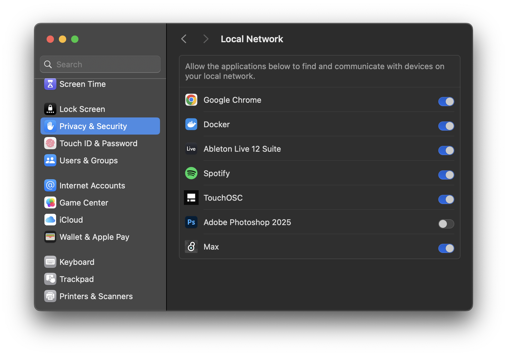
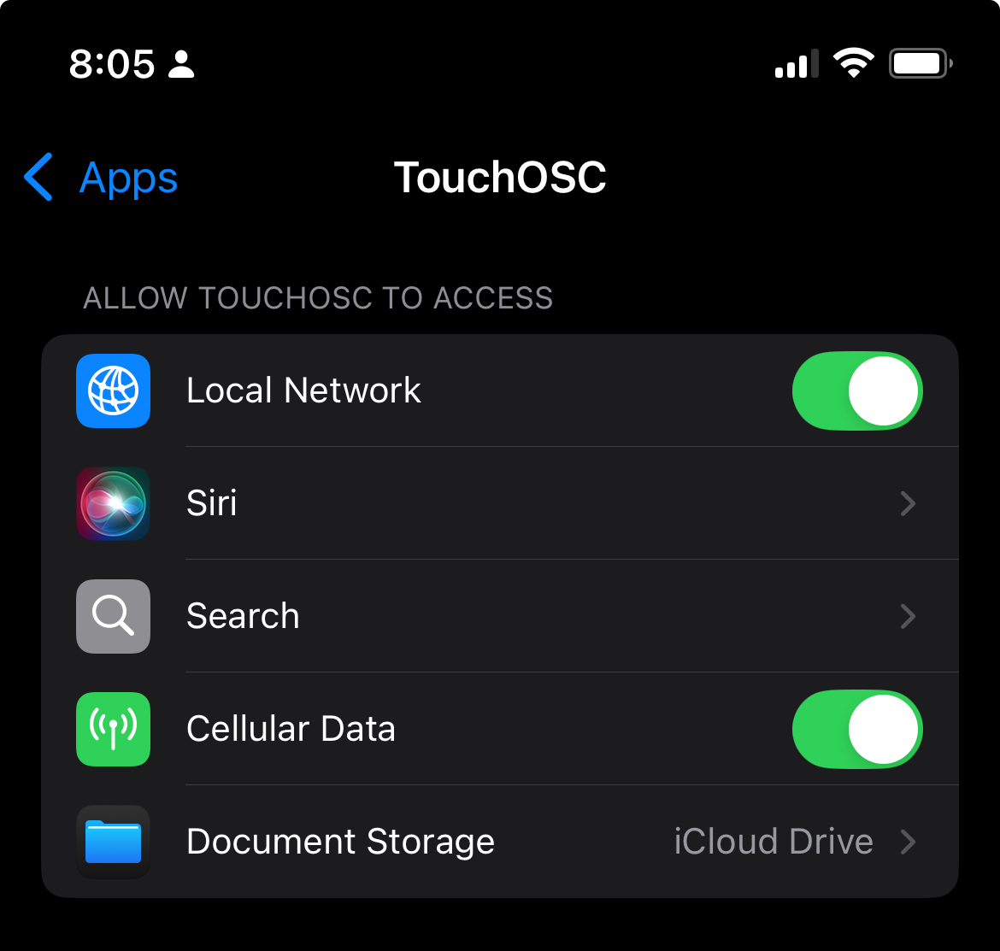
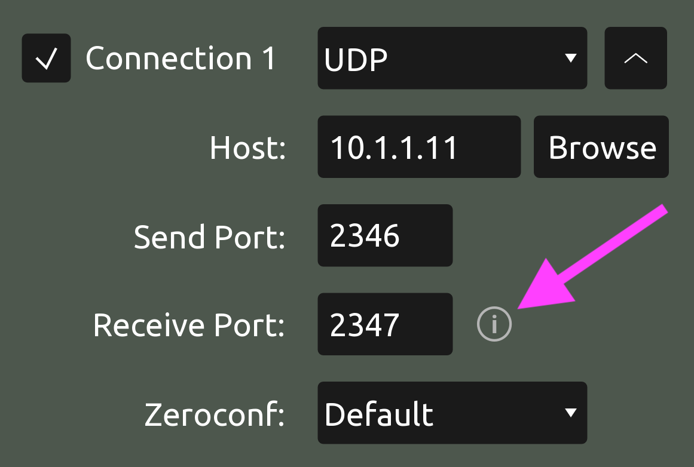
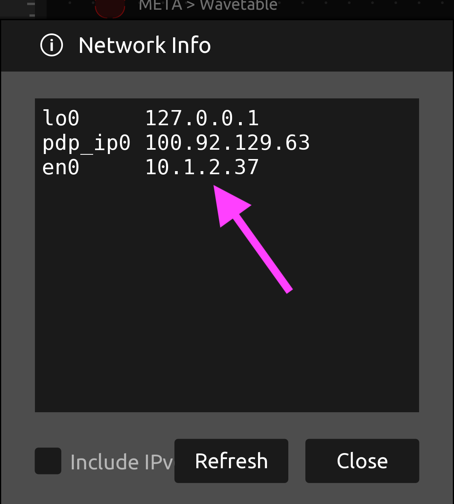
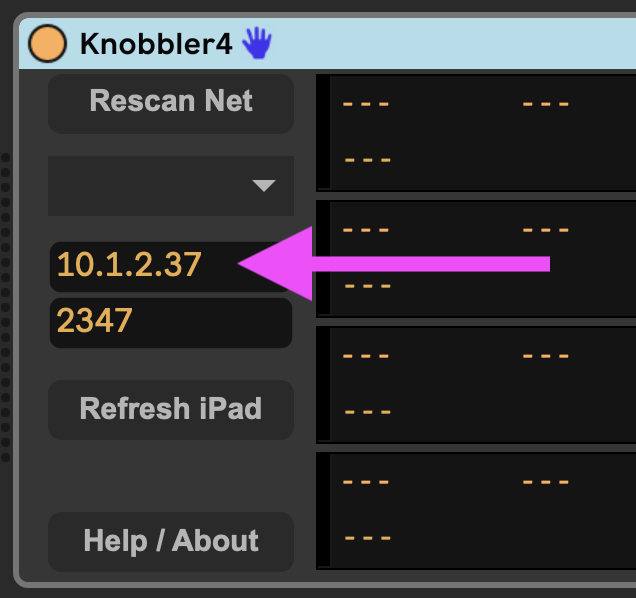

# Troubleshooting

### PROBLEM: I am unable to successfully browse my network for my computer / tablet.

This generally indicates either a problem with application permissions (more common) or WiFi network setup (less common).

On the Mac, ensure `Ableton Live` is given permission to browse the local network to discover devices. This is done in `System Settings` .. `Privacy & Security` .. `Local Network`. Ensure `Ableton Live` is enabled in your list.

On iOS, go to `Settings` .. `Apps` .. `TouchOSC`, and ensure its `Local Network` switch is enabled.

.

You may need to restart the apps or machines on the various sides of the connection for the changes to actually take effect.

If both sides have Local Network discovery enabled, then it's possible that the WiFi or other network equipment has this kind of discovery blocked.

Check in your network equipment's configuration interfaces around the terms "Bonjour", "Zeroconf", "uPnP", "mDNS", "Multicast DNS", or "Service Auto-Discovery". Some routers have options to disable this traffic, and many people don't know what it is and disable it.

### PROBLEM: I can move sliders on the tablet screen and see parameters in Ableton Live update, but no labels, colors, or values are shown on the tablet.

This indicates there is a problem with network data going from the computer to the tablet.

First, try clicking `Rescan Network` and choosing your tablet from the dropdown. If this fixes the problem, then it points to a prior incorrect value in the Hostname or Port fields that is now fixed.

If that does not work, then check to see if any other apps may be running on the tablet that could interfere with TouchOSC receiving data. Most likely this would be the app Protokol (mentioned below) used to debug the connection. If it is left running, it will eat all the network messages destined for TouchOSC. You will need to restart TouchOSC after closing Protokol.

If that still does not fix it, then in TouchOSC, ensure that you have the correct receive port number (2347) entered in the Knobbler4 device in Ableton Live.

If the port is correct, then the last thing to try is to use the tablet's IP address instead of its hostname in the Knobbler device configuration. To see the tablet's IP address, you can click the "(i)" icon in the OSC Connection Settings page.

Then note the IPv4 address next to `en0` or `en1`.

Use that IP address in the Host field in the Knobbler device instead of the tablet hostname.

Then click "Refresh iPad" to see if that fixes it.

If you've tried all that, please send screen shots or screen recordings to zack@steinkamp.us :)

### PROBLEM: Things are updating on the tablet, but moving the sliders on the tablet does not change or map any any parameters.

This indicates a problem in network communication from the tablet to Ableton Live.

First, ensure that there are not any programs open on the computer that may be "eating" the OSC messages from the tablet. Most commonly, these are Max and Protokol.

If you open Knobbler in Max to edit, you must completely quit out of Max in order for OSC / UDP to work properly. This is because Max holds on to the listening socket for the OSC messages even if you have closed the Knobbler device window.

You may also use Protokol to troubleshoot OSC issues, and if that is left open then it will keep eating those OSC packets.

If no other applications are open, then ensure the connection settings in TouchOSC on the tablet exactly follow the instructions in the the [README.md](README.md), including browsing for the computer hostname and port with Knobbler open in your Live Set.

You may need to use the IP address of your computer rather than browsing for it. You can get that from your computer's network settings. Make sure to get the address of the interface that you are actually using to connect to the tablet, e.g. wired Ethernet or WiFi.

You can use the app Protokol on your tablet (from the same people who make TouchOSC) to observe OSC messages. You will need to close TouchOSC before opening Protokol, and vice-versa for things to work properly.

### PROBLEM: I do not have a Blue Hand icon showing up in the currently selected device's title bar.

If you do not see the Blue Hand, then you will need to set up a "dummy" control surface in order for the Bluhand portion of Knobbler to work. To do this, you can open the settings in Live and switch to the Link, Tempo & MIDI tab. Chooose any supported control surface from the list ("ADVANCE" is a good choice) and assign its input to the IAC driver. The full list of tested control surfaces is available in [control-surfaces.txt](control-surfaces.txt).

If you do not have the IAC driver set up, then open the Audio & Midi Setup app, open the MIDI window, double click the IAC driver and make sure it is Online.

### PROBLEM: HALP! Nothing above covers what I'm experiencing!

Send me any info you can cobble together with a clear description of the problem and steps that got you there, things you tried, other things in your environment or configuration that might be relevant, events from your childhood that relate, etc. zack@steinkamp.us
